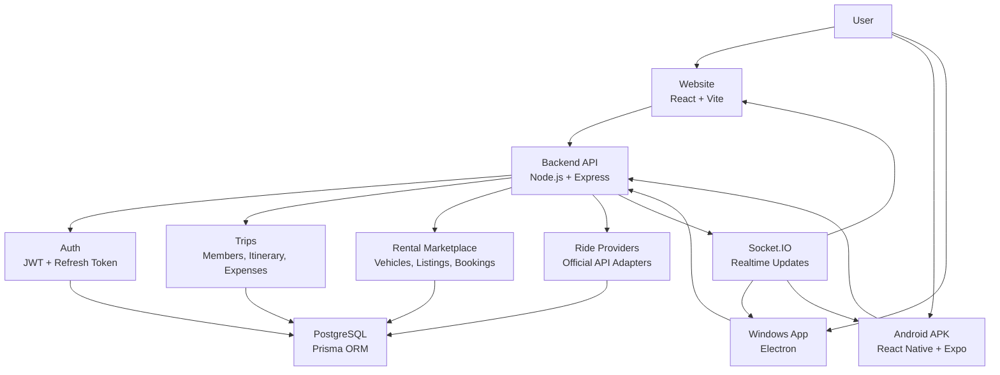

# Trekunity

Trekunity is a travel coordination system for groups, rides, and self-drive rentals. One backend powers three clients:

- Website: React + Vite
- Android APK: React Native + Expo
- Windows app: Electron `.exe`

The goal is simple: users can plan trips, check ride/rental options, and book marketplace rentals from one connected system.

## What This Project Does

- Group trip planning with members, itinerary, expenses, and notifications.
- User accounts with JWT authentication.
- Ride comparison screen prepared for official provider APIs.
- Self-drive rental marketplace like Zoomcar style host/listing/booking flow.
- One shared backend for website, APK, and desktop app.
- Mobile-friendly UI and packaged desktop/mobile builds.

> Ride providers such as Ola, Uber, Rapido, and Zoomcar require official APIs or partner access for real fares/bookings. This project does not collect user app passwords or OTPs.

## System Graph



## How The Apps Sync

All clients talk to the same Express backend:

- Website dev uses Vite proxy: `/api`
- Desktop packaged app uses: `http://127.0.0.1:3001/api`
- Android emulator uses: `http://10.0.2.2:3001/api`
- Physical Android phone uses your PC LAN URL printed by backend, for example `http://192.168.1.10:3001/api`

In the APK, open `Account`, paste the backend URL in `Backend API URL`, then tap `Sync Backend`.

## Project Structure

```text
Travel-Together/
├── backend/                 Express API, Prisma, Socket.IO
│   ├── prisma/              Database schema and migrations
│   └── src/
│       ├── controllers/     Request logic
│       ├── middleware/      Auth, errors, not found
│       ├── routes/          REST API routes
│       ├── socket/          Realtime handlers
│       └── utils/           JWT, Prisma, app errors
├── frontend/                Website client
│   └── src/
│       ├── api/             Axios API client
│       ├── components/      Shared UI
│       ├── pages/           App screens
│       └── store/           Zustand auth state
├── apps/mobile/             Android app
│   ├── App.js               Mobile screens
│   ├── src/api.js           Mobile API client
│   └── android/             Generated native Android project
├── desktop/                 Electron desktop wrapper
├── graphify-out/            Project memory/scope map
└── BUILD_TARGETS.md         Build notes
```

## Tech Stack

| Area | Tools |
| --- | --- |
| Website | React, Vite, Zustand, Axios |
| Mobile | React Native, Expo |
| Desktop | Electron, Electron Builder |
| Backend | Node.js, Express, Socket.IO |
| Database | PostgreSQL, Prisma |
| Auth | JWT access token, refresh token cookies |
| Payments/Media/Email | Stripe, Cloudinary, Resend |

## Setup

Install dependencies:

```bash
npm install
```

Create backend env:

```bash
copy backend\.env.example backend\.env
```

Update `backend/.env` with your real database and secret values.

Generate Prisma client:

```bash
npm run build:backend
```

Run database migration:

```bash
npm run db:migrate --workspace=backend
```

## Run In Development

Run website and backend together:

```bash
npm run dev
```

Run only backend:

```bash
npm run dev:backend
```

Run only website:

```bash
npm run dev:frontend
```

Run mobile development server:

```bash
npm run dev:mobile
```

Run desktop wrapper:

```bash
npm run dev:desktop
```

## Build Outputs

Website:

```bash
npm run build:frontend
```

Output: `frontend/dist`

Android APK:

```bash
cd apps/mobile/android
.\gradlew.bat assembleDebug
```

Output: `apps/mobile/android/app/build/outputs/apk/debug/app-debug.apk`

Windows `.exe`:

```bash
npm run build:desktop:exe
```

Output: `desktop/release/Trekunity Setup 1.0.0.exe`

## Backend API Areas

- `/api/auth` login, register, refresh, logout, current user
- `/api/trips` trip creation, joining, details
- `/api/rentals` listings and bookings
- `/api/vehicles` host vehicles
- `/api/rides` official provider integration surface
- `/api/config` shared client config
- `/health` backend health check

## Important Notes

- Start the backend before using website, desktop, or APK features that need data.
- For a physical Android device, backend and phone must be on the same network.
- Real ride fare comparison needs approved provider API credentials.
- Debug APK is for testing. Production release needs a proper signing key.
